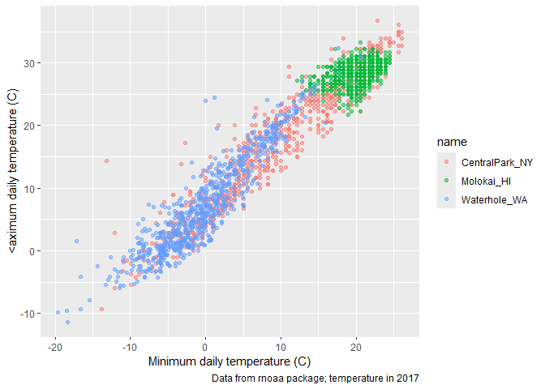
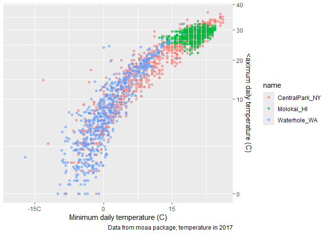
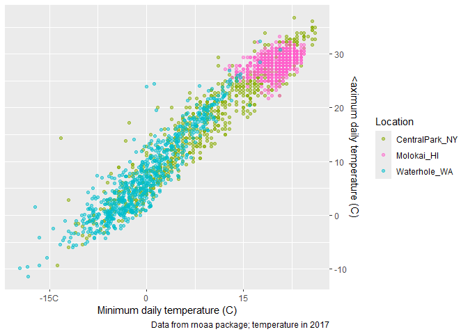
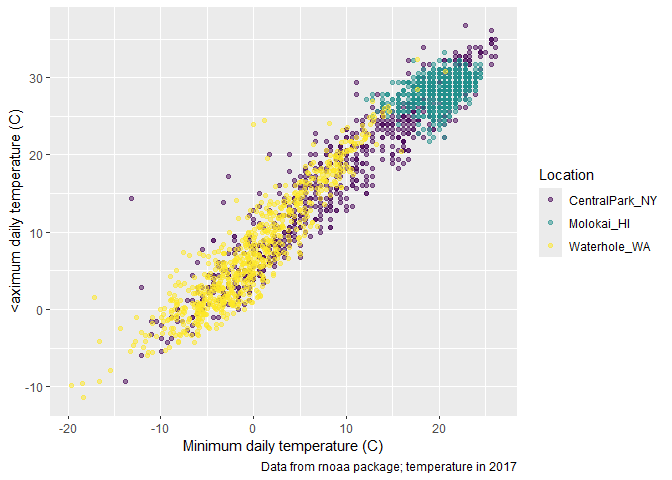

Visualization Part 2
================

Import the weather data

``` r
weather_df = 
  rnoaa::meteo_pull_monitors(
    c("USW00094728", "USW00022534", "USS0023B17S"), # assess data online allowed by rnoaa package
    var = c("PRCP", "TMIN", "TMAX"), 
    date_min = "2021-01-01",
    date_max = "2022-12-31") %>%
  mutate(
    name = case_match(
      id, 
      "USW00094728" ~ "CentralPark_NY", 
      "USW00022534" ~ "Molokai_HI",
      "USS0023B17S" ~ "Waterhole_WA"),
    tmin = tmin / 10,
    tmax = tmax / 10) %>%
  select(name, id, everything())
```

    ## using cached file: C:/Users/ASUS/AppData/Local/R/cache/R/rnoaa/noaa_ghcnd/USW00094728.dly

    ## date created (size, mb): 2025-09-25 10:34:01.511602 (8.763)

    ## file min/max dates: 1869-01-01 / 2025-09-30

    ## using cached file: C:/Users/ASUS/AppData/Local/R/cache/R/rnoaa/noaa_ghcnd/USW00022534.dly

    ## date created (size, mb): 2025-09-25 10:34:21.229769 (4.018)

    ## file min/max dates: 1949-10-01 / 2025-09-30

    ## using cached file: C:/Users/ASUS/AppData/Local/R/cache/R/rnoaa/noaa_ghcnd/USS0023B17S.dly

    ## date created (size, mb): 2025-09-25 10:34:27.538198 (1.08)

    ## file min/max dates: 1999-09-01 / 2025-09-30

## remember this plot

``` r
weather_df %>% 
  ggplot(aes(x = tmin, y = tmax, color = name)) +
  geom_point(alpha = .5)
```

    ## Warning: Removed 17 rows containing missing values or values outside the scale range
    ## (`geom_point()`).

<!-- -->

Adding labels

``` r
weather_df %>% 
  ggplot(aes(x = tmin, y = tmax, color = name)) +
  geom_point(alpha = .5) +
  labs(
    titlle = "Temperature Plot",
    x = "Minimum daily temperature (C)", 
    y = "<aximum daily temperature (C)",
    caption = "Data from rnoaa package; temperature in 2017"
  )
```

    ## Warning: Removed 17 rows containing missing values or values outside the scale range
    ## (`geom_point()`).

<!-- -->

## scales

``` r
weather_df %>% 
  ggplot(aes(x = tmin, y = tmax, color = name)) +
  geom_point(alpha = .5) +
  labs(
    titlle = "Temperature Plot",
    x = "Minimum daily temperature (C)", 
    y = "<aximum daily temperature (C)",
    caption = "Data from rnoaa package; temperature in 2017"
  ) + 
  scale_x_continuous(
    # scale of breaks
    breaks = c(-15, 0, 15), 
    #label names shown for scale
    labels = c("-15C", "0", "15")
  ) + 
  scale_y_continuous(
    # sqrt transformation and other transformations e.i. log transformation can be applied
    trans = "sqrt", 
    # change the scale position in the figure
    position = "right"
  )
```

    ## Warning in transformation$transform(x): NaNs produced

    ## Warning in scale_y_continuous(trans = "sqrt", position = "right"): sqrt
    ## transformation introduced infinite values.

    ## Warning: Removed 142 rows containing missing values or values outside the scale range
    ## (`geom_point()`).

<!-- -->

``` r
weather_df %>% 
  ggplot(aes(x = tmin, y = tmax, color = name)) +
  geom_point(alpha = .5) +
  labs(
    titlle = "Temperature Plot",
    x = "Minimum daily temperature (C)", 
    y = "<aximum daily temperature (C)",
    caption = "Data from rnoaa package; temperature in 2017"
  ) + 
  scale_x_continuous(
    breaks = c(-15, 0, 15), 
    labels = c("-15C", "0", "15")
  ) + 
  scale_y_continuous(
    position = "right"
  ) + 
  scale_color_hue(
    name = "Location",
    h = c(100, 2000))
```

    ## Warning: Removed 17 rows containing missing values or values outside the scale range
    ## (`geom_point()`).

<!-- -->

``` r
weather_df %>% 
  ggplot(aes(x = tmin, y = tmax, color = name)) +
  geom_point(alpha = .5) +
  labs(
    titlle = "Temperature Plot",
    x = "Minimum daily temperature (C)", 
    y = "<aximum daily temperature (C)",
    caption = "Data from rnoaa package; temperature in 2017"
  ) + 
  # this is better for coloring
  viridis::scale_color_viridis(
    name = "Location", 
    discrete = TRUE
  )
```

    ## Warning: Removed 17 rows containing missing values or values outside the scale range
    ## (`geom_point()`).

<!-- -->
